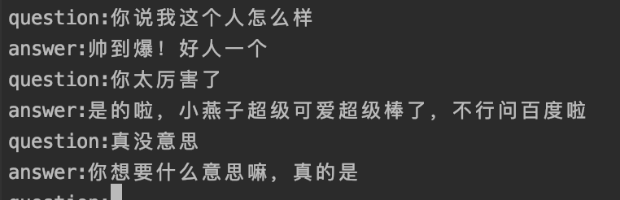

# Seq2Seq ncnn

## the C++ version of Seq2Seq with ncnn

## 环境
本项目环境基于macos，其他环境到[ncnn](https://github.com/Tencent/ncnn)官网下载相关库


训练了一个基于青云对话语料的seq2seq模型，结果不太好，仅供娱乐
```
mkdir build
cd build 
cmake ..
make 
./chatbot 
```

## 结果展示



## 参考

[ncnn](https://github.com/Tencent/ncnn)
[pytorch-seq2seq](https://github.com/IBM/pytorch-seq2seq)
[cppjieba](https://github.com/yanyiwu/cppjieba)
